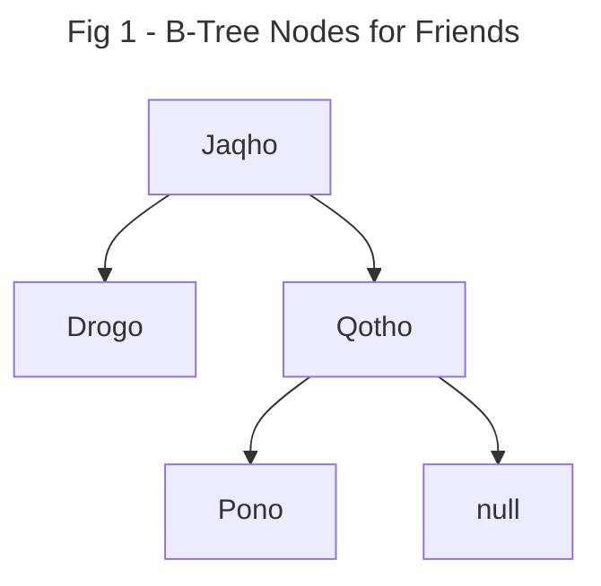
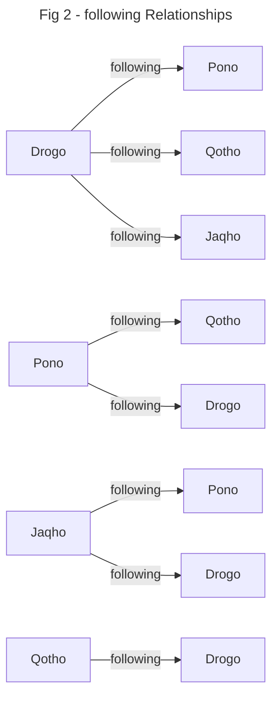
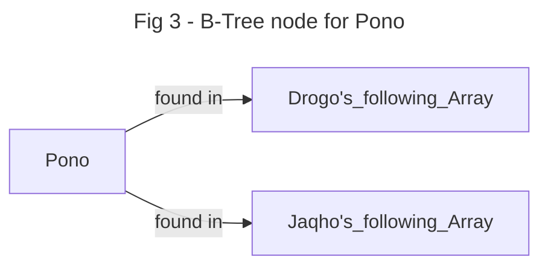

When thinking about a large many-to-many relationship, we need to consider how an array will grow:

```json

{
  _id: "Cam",
  followers: []
}

```

In this example document for a user in a social networking site, the followers array is problematic because it can expand without boundary, e.g. if we were to add a celebrity to our network, they would likely have **millions** of followers.

```json
{
  _id: "Khal Drogo",
  followers: ["you", "me", ...thousands of other Game of Thrones fans]
}

```

This is an example of a suboptimal schema design. However, we can improve on this design by inverting the relationship we're trying to model. To clarify, instead of follow**ers**, let's try follow**ing**:


```json
{
  _id: "Khal Drogo",
  following: ["Khaleesi", "Qotho", "Pono", "Jaqho"]
}

```


An artifact of human social networks, the list of people we are following (at least, ones we actually care about) is in the [range of around 200 people](https://en.wikipedia.org/wiki/Dunbar's_number).

We have solved for being able to _store_ the data, but what about _querying_ it? I can easily look up who Khal Drogo is following, but the reverse process is quite slow. Searching through each array of `following` for each user is important because it defines who the follow**ers** are of each user, i.e. the sum total of all the documents which contain "Drogo" in their array for `following` is the set of users that are all following Drogo.  We'll have to conduct a full collection scan, walking each element of every array in order to find all of the follow**ers** of Khal Drogo. 


However, if I build an index on `following` I can facilitate fast, efficient queries!

```js
db.characters.createIndex({following: 1})
```

For the `following` field, I have now created a [Multikey Index](https://www.mongodb.com/docs/manual/core/indexes/index-types/index-multikey/). Each individual (and unique) value of the `following` array on each document will be a separate entry in the index.

Let's first visualize the B-tree of nodes:



We can see that there are nodes for each friend in this group. Next, let's visualize the relationships of each of the friends



In the previous diagram we can see that there are relationships for "following" for each of the friends in this group. Note that even if Drogo had one million followers, he would only appear on the left side of this diagram once pointing to the people he follows, even though he may be the target of millions of follow**ers**. In MongoDB, if we index the `follows` array for each document, we'll have pointers on each of the nodes that we saw in the earlier diagram showing the nodes of the B-tree. 

As a quick example, here's what the node for the user Pono would look like:



There is an equivalent set of pointers found for each of the users in the dataset. 

Let's take a look at a more concrete example using Javascript

# Examples

The example here is broken up into different sections for the data, indexes, and queries.

## Dataset

```js
db.characters.insertMany([
  {
    _id: "Qotho",
    following: ["Drogo"]
  },{
    _id: "Drogo",
    following: ["Pono", "Qotho", "Jaqho"]
  },{
    _id: "Pono",
    following: ["Qotho", "Drogo"]
  },{
    _id: "Jaqho",
    following: ["Pono", "Drogo"]
  }
])
```

## Index Creation

```js
db.characters.createIndex({following: 1})
```

## Queries

Find anyone who Drogo is follow**ing**
```js
db.characters.find({_id: "Drogo"})
```

with explain:

```js
db.characters.explain("executionStats").find({_id: "Drogo"})
```

Note that because we are looking for the people that _Drogo is following_, we simply need to find the doc that belongs to his `_id`, which contains an array of the people he follows.

Find all of the follw**ers** of Drogo.
```js

db.characters.find({following: "Drogo" })

```
with explain: 

```js

db.characters.explain("executionStats").find({following: "Drogo" })

```

Notice that in the explain for this query, because the `following` field has been indexed, this is now a fast and efficient lookup! If we hadn't indexed on this field then we would potentially have to scan every value in every array for each document in the collection. Because we have indexed the `follows` field, we simply find the node in the B-tree for the value "Drogo", which will have pointers to each document that contains "Drogo" in its `follows` array.
